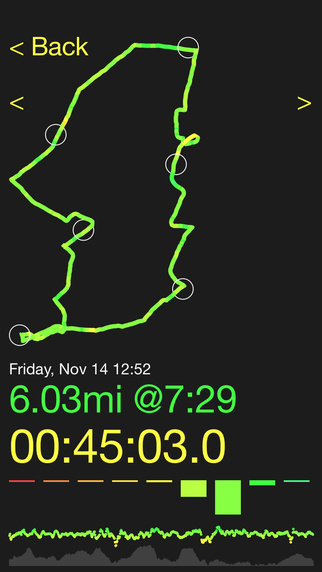

# Runalysis

Runalysis is a basic running app for iOS written in Swift. The intent is to not focus on /where/ you went, but rather /how/ it went. I am a runner and I wrote this as a way to learn iOS and Swift, and hopefully others will be able to use what I have learned :)

It allows you to schedule workouts on a weekly basis to quickly see your history and upcoming schedule.

Instead of displaying your run on a map, it displays your course using colors corresponding with your velocity. This gives a quick visual understanding of how consistent your run was. It also displays simple graphs that can be used to visualize metrics like altitude and velocity.

[Runalysis Website](http://runalysis.com)

[Runalysis in the App Store](https://itunes.apple.com/us/app/runalysis/id925008157?mt=8)

## Goals

The goal is to eventually provide an easy-to-digest view of your workout. There are several features that would help make this an even more useful training tool.
- Incorporate methods to adjust velocity with respect to gradient
- Analyze consistency in stride count
- Track and analyze heartrate
- Export your workouts so that you can incoporate with other services

## License

MIT License

Copyright (c) 2015 Kevin Hankens

Permission is hereby granted, free of charge, to any person obtaining a copy of this software and associated documentation files (the "Software"), to deal in the Software without restriction, including without limitation the rights to use, copy, modify, merge, publish, distribute, sublicense, and/or sell copies of the Software, and to permit persons to whom the Software is furnished to do so, subject to the following conditions:

The above copyright notice and this permission notice shall be included in all copies or substantial portions of the Software.

THE SOFTWARE IS PROVIDED "AS IS", WITHOUT WARRANTY OF ANY KIND, EXPRESS OR IMPLIED, INCLUDING BUT NOT LIMITED TO THE WARRANTIES OF MERCHANTABILITY, FITNESS FOR A PARTICULAR PURPOSE AND NONINFRINGEMENT. IN NO EVENT SHALL THE AUTHORS OR COPYRIGHT HOLDERS BE LIABLE FOR ANY CLAIM, DAMAGES OR OTHER LIABILITY, WHETHER IN AN ACTION OF CONTRACT, TORT OR OTHERWISE, ARISING FROM, OUT OF OR IN CONNECTION WITH THE SOFTWARE OR THE USE OR OTHER DEALINGS IN THE SOFTWARE.
